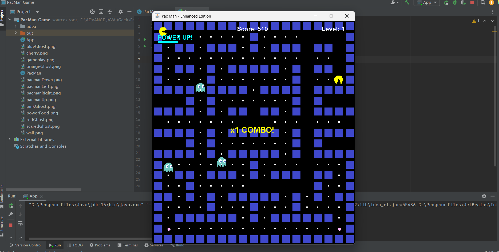

# 🎮 Enhanced Pac-Man Game  

Relive the nostalgia of the classic Pac-Man, now reborn in Java Swing with a modern touch! 🟡
Guide Pac-Man through winding mazes, munch on pellets, and dodge clever ghosts 👻 as the challenge intensifies with every level.

This enhanced version adds a new layer of fun with power-ups, combo scoring, animated graphics, and progressive speed levels.
Developed entirely with core Java, it highlights the power of object-oriented design, real-time rendering, and event-driven game loops.

---

## 🌟 Features  

### 🧩 Core Gameplay  
- **Classic Pac-Man Mechanics:** Smooth four-directional movement using arrow keys.  
- **Intelligent Ghost AI:** Four ghosts with random pathfinding behavior.  
- **Accurate Collision Detection:** Detects walls, food, ghosts, and power-ups.  
- **Multi-Level Progression:** Infinite levels with increasing speed and difficulty.  

### ⚡ Enhanced Features  
- 🟡 **Power-Up Mode:** Eat power pellets to chase and eat ghosts for bonus points.  
- 💥 **Combo Multiplier:** Consecutive ghost captures increase your score (200 → 400 → 600 → 800).  
- 📊 **High Score Tracking:** Automatically stores your best score.  
- 🎨 **Animated Graphics:** Smooth Pac-Man animations and pulsing power-ups.  
- ⏸️ **Pause Functionality:** Press **SPACE** to pause/resume.  
- 🌀 **Screen Wrapping:** Move across screen edges strategically.  
- 💀 **Lives System:** Three lives displayed on the game screen.  

---

## 🎯 Screenshots 

### 🕹️ Gameplay  
Experience the fast-paced classic Pac-Man action with smooth controls and ghost AI.

  


### ⚡ Power-Up Mode  
Watch Pac-Man turn the tables and chase ghosts after eating a power pellet! 

 


### 💀 Game Over Screen  
Displays your final score and high score with a retry option.  

  


---


## 🕹️ How to Play  

| Action | Key |
|:--|:--|
| Move Up | ⬆️ Arrow Up |
| Move Down | ⬇️ Arrow Down |
| Move Left | ⬅️ Arrow Left |
| Move Right | ➡️ Arrow Right |
| Pause / Resume | SPACE |
| Exit Game | ESC |

---
🎯 **Goal:**  
Eat all pellets while avoiding ghosts. Grab power-ups to hunt them for extra points!  

---

## 🛠️ Technical Stack  
- **Language:** Java 8+  
- **GUI Framework:** Java Swing  
- **Graphics:** Java AWT (Graphics2D)  
- **Architecture:** Event-driven design pattern  
- **Game Loop:** Timer-based rendering at 20 FPS  

---

## 📋 Requirements  
- Java Development Kit (**JDK 8 or higher**)  
- Java Runtime Environment (**JRE**)  
- No external dependencies required  

---

## 🚀 Installation & Setup  
## 1️⃣ Prerequisites

Make sure you have the following installed:

- ☕ **Java Development Kit (JDK 8 or higher)**
- 💻 **Java Runtime Environment (JRE)**
- 🗂️ **Any code editor or IDE** (like IntelliJ IDEA, VS Code, or NetBeans)

---

## 2️⃣ Clone the Repository

Open your terminal and run:

```bash
git clone https://github.com/yourusername/pacman-java-game.git
cd pacman-java-game
```

---

## 3️⃣ Compile the Game

Run this command to compile the Java files:

```bash
javac PacMan.java
```

---

## 4️⃣ Run the Game

Start the game using:

```bash
java PacMan
```

---

## 5️⃣ Play and Enjoy 🎮

- Use Arrow Keys to move Pac-Man 🟡
- Press SPACE to pause or resume ⏸️
- Collect all dots, avoid ghosts 👻, and aim for a high score!
